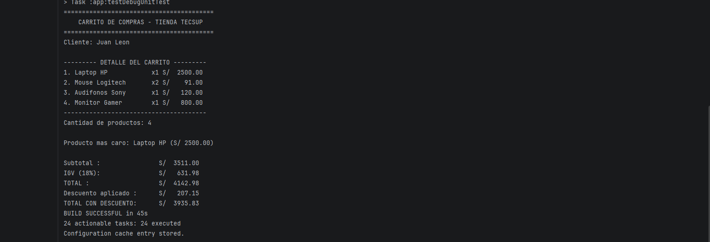

# Laboratorio 02: Carrito de Compras en Kotlin (Versión sin IA)

**Curso:** Desarrollo de Aplicaciones Móviles  
**Estudiante:** José León Barzola Veliz  
**Sección:** B  
**Repositorio:** [Mobiles-Seccion-B](https://github.com/jbarzolav/Mobiles-Seccion-B)

---

## Descripción del Programa

Este programa implementa un **carrito de compras** para la Tienda Tecsup utilizando Kotlin. El sistema permite:

- **Modelar productos** con nombre, precio y cantidad usando `open class`
- **Calcular subtotales** sumando el precio × cantidad de cada producto
- **Calcular IGV** (18%) sobre el subtotal
- **Calcular el total** a pagar (subtotal + IGV)
- **Identificar el producto más caro** usando `maxByOrNull`
- **Aplicar descuentos** según el monto total usando `when`
- **Buscar productos** por nombre usando `find`
- **Eliminar productos** por nombre usando `removeIf`
- **Generar un reporte detallado** con columnas alineadas usando `String.format`

### Funciones Implementadas

| Función | Descripción |
|---------|-------------|
| `calcularSubtotal()` | Suma los importes de todos los productos |
| `calcularIGV()` | Calcula el 18% del subtotal |
| `calcularTotal()` | Suma subtotal + IGV |
| `calcularDescuento()` | Aplica descuento según el monto total |
| `mostrarDetalle()` | Muestra el reporte formateado con columnas alineadas |
| `buscarProducto()` | Busca un producto por nombre usando `find` |
| `eliminarProducto()` | Elimina un producto por nombre usando `removeIf` |
| `main()` | Función principal que ejecuta todo el flujo |

---

## Explicación Detallada por Partes

### PARTE 1: Modelo de Datos

**Qué se hizo:** Crear la estructura que representa un producto en el carrito.

**Código:**
```kotlin
open class Producto(val nombre: String, val precio: Double, var cantidad: Int) {
    open fun calcularSubtotal(): Double = precio * cantidad
}
```

**¿Por qué `open class`?**
- `open class`: Clase que puede ser heredada por otras clases
- Sin `open`, Kotlin impide la herencia por defecto (seguridad)

**¿Por qué `val` vs `var`?**

| Propiedad | Tipo | Razón |
|-----------|------|-------|
| `nombre` | `val` | El nombre del producto no debería cambiar después de crearlo |
| `precio` | `val` | El precio base es fijo, se modifica con funciones separadas |
| `cantidad` | `var` | La cantidad cambia cuando el usuario agrega/quita unidades |

**¿Qué pasa si intento cambiar un `val`?**
```kotlin
val precio = 2500.0
precio = 999.0  // ❌ ERROR: Val cannot be reassigned
```
Kotlin protege la integridad de los datos. Esto evita bugs accidentales.

**Función `main()` inicial:**
```kotlin
fun main() {
    val nombreCliente = "Juan Leon"
    val carrito = mutableListOf<Producto>()
    
    println("Cliente: $nombreCliente")
    
    carrito.add(Producto("Laptop HP", 2500.0, 1))
    carrito.add(Producto("Mouse Logitech", 45.5, 2))
    
    for (producto in carrito) {
        println("Producto agregado: ${producto.nombre}")
    }
}
```

**Conceptos:**
- `mutableListOf<Producto>()` → Lista vacía que permite agregar/eliminar elementos
- `add()` → Método para agregar elementos a la lista
- `for (producto in carrito)` → Bucle que recorre cada elemento
- `"Cliente: $nombreCliente"` → String template para insertar variables

---

### PARTE 2: Funciones de Cálculo

**Qué se hizo:** Separar la lógica en funciones reutilizables.

**Función 1: Calcular Subtotal**
```kotlin
fun calcularSubtotal(productos: List<Producto>): Double {
    var subtotal = 0.0
    for (p in productos) {
        subtotal += p.precio * p.cantidad
    }
    return subtotal
}
```

| Elemento | Explicación |
|----------|-------------|
| `productos: List<Producto>` | Parámetro de tipo inmutable (la función no modifica la lista) |
| `: Double` | Tipo de retorno explícito |
| `var subtotal = 0.0` | Variable local mutable para acumular |
| `+=` | Operador de acumulación (subtotal = subtotal + ...) |
| `return subtotal` | Retorna el valor calculado |

**¿Por qué `List<Producto>` y no `MutableList<Producto>`?**
- Buenas prácticas: las funciones de cálculo no deberían modificar la lista
- Si usáramos `MutableList`, la función podría modificar el carrito accidentalmente

**Función 2: Calcular IGV**
```kotlin
fun calcularIGV(subtotal: Double): Double {
    return subtotal * 0.18
}
```
- Recibe el subtotal como parámetro
- Retorna el 18% (IGV peruano)
- Función pura: solo calcula, no tiene efectos secundarios

**Función 3: Calcular Total**
```kotlin
fun calcularTotal(subtotal: Double, igv: Double): Double {
    return subtotal + igv
}
```
- Suma subtotal + IGV
- Se separó en 3 funciones para mayor claridad y reutilización

**¿Por qué separar en 3 funciones?**
1. **Claridad**: Cada función hace una cosa específica
2. **Reutilización**: Se pueden usar independientemente
3. **Testing**: Fácil de probar cada función por separado
4. **Mantenimiento**: Si cambia el IGV, solo se modifica una función

---

### PARTE 3: Reporte con Formato

**Qué se hizo:** Crear una función que muestra el detalle con columnas alineadas.

**Código:**
```kotlin
fun mostrarDetalle(productos: List<Producto>) {
    println("---------- DETALLE DEL CARRITO ----------")
    var i = 1
    for (p in productos) {
        val importe = p.precio * p.cantidad
        println(String.format("%d. %-20s x%d S/ %8.2f", i, p.nombre, p.cantidad, importe))
        i++
    }
    println("------------------------------------------")
}
```

**Explicación de `String.format()`:**

| Símbolo | Significado | Ejemplo |
|---------|-------------|---------|
| `%d` | Entero | `1`, `2`, `3` |
| `%-20s` | String alineado a la izquierda en 20 espacios | `"Laptop HP           "` |
| `%8.2f` | Decimal con 2 decimales, alineado a la derecha en 8 espacios | `2500.00` |

**Ejemplo visual:**
```
1. Laptop HP           x1 S/  2500.00
2. Mouse Logitech      x2 S/    91.00
3. Audifonos Sony      x1 S/   120.00
```

**¿Por qué `String.format` y no string templates?**
- `String.format` permite controlar la alineación y el ancho de las columnas
- Los string templates (`"$variable"`) no tienen control de formato
- Para reportes con columnas alineadas, `String.format` es la herramienta correcta

---

### PARTE 4: Producto Más Caro y Descuento

**Qué se hizo:** Implementar dos funcionalidades avanzadas usando funciones de Kotlin.

**1. Producto Más Caro:**
```kotlin
val masCaro = carrito.maxByOrNull { it.precio }
if (masCaro != null) {
    println("Producto más caro: ${masCaro.nombre} " +
            String.format("(S/ %.2f)", masCaro.precio))
}
```

**¿Qué hace `maxByOrNull`?**
- Recorre la lista y retorna el elemento con el valor más alto según la lambda
- Si la lista está vacía, retorna `null` (por eso el `if`)
- `{ it.precio }` → Lambda que indica comparar por precio

**¿Por qué no `maxOf`?**
- `maxOf` lanza excepción si la lista está vacía
- `maxByOrNull` es más seguro, retorna `null` en lugar de fallar

**2. Descuento con `when`:**
```kotlin
fun calcularDescuento(total: Double): Double {
    return when {
        total > 5000 -> total * 0.10  // 10% si supera S/ 5000
        total > 3000 -> total * 0.05  // 5% si supera S/ 3000
        else -> 0.0                    // Sin descuento
    }
}
```

**¿Por qué `when` sin argumento?**
- `when` con argumento: `when (opcion) { 1 -> ..., 2 -> ... }`
- `when` sin argumento: evalúa expresiones booleanas (`total > 5000`)
- Es equivalente a un `if-else` chain pero más legible

**¿Por qué `else -> 0.0`?**
- Si ninguna condición se cumple, no hay descuento
- Retorna 0.0 para mantener el tipo de retorno consistente

---

### PARTE 5: POO - Programación Orientada a Objetos

**Qué se hizo:** Agregar encapsulamiento, herencia, polimorfismo y abstracción.

### Encapsulamiento
```kotlin
open class Producto(val nombre: String, val precio: Double, var cantidad: Int) {
    open fun calcularSubtotal(): Double = precio * cantidad
}
```
Datos y comportamiento juntos en una clase.

### Herencia
```kotlin
class ProductoDigital(nombre: String, precio: Double, cantidad: Int, val formato: String) 
    : Producto(nombre, precio, cantidad) {
    override fun calcularSubtotal(): Double = precio * cantidad * 0.9
}
```
`ProductoDigital` hereda de `Producto` y agrega un descuento del 10%.

### Polimorfismo
```kotlin
for (p in carrito) {
    println(p.calcularSubtotal())  // Se ejecuta según el tipo
}
```
Mismo método, diferente comportamiento según el tipo de producto.

### Abstracción
```kotlin
interface Calculable {
    fun calcular(): Double
}
```
Contrato que define qué se debe hacer sin importar cómo.

---

### PARTE 6: Buscar y Eliminar Producto

**Qué se hizo:** Implementar búsqueda y eliminación de productos.

**Buscar producto:**
```kotlin
fun buscarProducto(productos: List<Producto>, nombre: String): Producto? {
    return productos.find { it.nombre.equals(nombre, ignoreCase = true) }
}
```

**Eliminar producto:**
```kotlin
fun eliminarProducto(productos: MutableList<Producto>, nombre: String): Boolean {
    return productos.removeIf { it.nombre.equals(nombre, ignoreCase = true) }
}
```

**Conceptos:**
- `find`: Busca el primer elemento que cumple la condición
- `removeIf`: Elimina todos los elementos que cumple la condición
- `ignoreCase = true`: No distingue mayúsculas/minúsculas
- `Producto?`: Tipo nullable (puede retornar null si no encuentra)

---

## Resumen de Conceptos Kotlin por Parte

| Parte | Conceptos Principales |
|-------|----------------------|
| Parte 1 | `open class`, `val` vs `var`, `mutableListOf()`, string templates |
| Parte 2 | Funciones con tipos explícitos, `List` vs `MutableList`, `return` |
| Parte 3 | `String.format()`, alineación de columnas, bucles `for` |
| Parte 4 | `maxByOrNull`, `when` sin argumento, funciones puras |
| Parte 5 | Encapsulamiento, Herencia, Polimorfismo, Abstracción |
| Parte 6 | `find`, `removeIf`, tipos nullable |

---

## Respuesta a la Pregunta de la Parte 1 (val vs var)

> **¿Por qué nombre y precio son `val` pero `cantidad` es `var`? ¿Qué pasaría si intentas cambiar el precio después de crear el producto?**

### Análisis

- **`nombre` y `precio` son `val`** porque son propiedades **inmutables** que definen la identidad y costo base de un producto. Una vez creado un "Laptop HP" con precio S/ 2500.0, estas propiedades no deberían cambiar directamente.

- **`cantidad` es `var`** porque es una propiedad **mutable** que representa cuántas unidades de ese producto tenemos en el carrito. Esta información cambia cuando el usuario agrega o quita unidades.

### ¿Qué pasa si intento cambiar el precio?

```kotlin
val producto = Producto("Laptop HP", 2500.0, 1)
producto.precio = 999.0  // ❌ ERROR: Val cannot be reassigned
```

Obtendríamos un **error de compilación** porque `precio` está declarado con `val`. Kotlin protege la integridad de los datos impidiendo la reasignación de propiedades inmutables. Esto es una buena práctica porque:

1. **Seguridad**: Evita modificaciones accidentales
2. **Claridad**: El código indica claramente qué propiedades pueden cambiar
3. **Concurrencia**: Las propiedades `val` son seguras en hilos múltiples

---

## Captura de Salida



```text
=========================================
   CARRITO DE COMPRAS - TIENDA TECSUP   
=========================================

Cliente: Juan Leon

--------- DETALLE DEL CARRITO ---------
1. Laptop HP            x1 S/  2500.00
2. Mouse Logitech       x2 S/    91.00
3. Audifonos Sony       x1 S/   120.00
4. Curso Kotlin         x1 S/   135.00
---------------------------------------
Cantidad de productos: 4

Producto más caro: Laptop HP (S/ 2500.00)

Subtotal :                S/  2846.00
IGV (18%):                S/   512.28
TOTAL :                   S/  3358.28
Descuento aplicado :      S/   167.91
TOTAL CON DESCUENTO:      S/  3190.37

========== BUSCAR PRODUCTO ==========
Producto encontrado: Mouse Logitech - S/ 45.5

========== ELIMINAR PRODUCTO ==========
Producto 'Audifonos Sony' eliminado del carrito

--------- DETALLE DEL CARRITO ---------
1. Laptop HP            x1 S/  2500.00
2. Mouse Logitech       x2 S/    91.00
3. Curso Kotlin         x1 S/   135.00
---------------------------------------
Cantidad de productos: 3

Subtotal :                S/  2726.00
IGV (18%):                S/   490.68
TOTAL :                   S/  3216.68
Descuento aplicado :      S/   160.83
TOTAL CON DESCUENTO:      S/  3055.85
```

---

## Cómo Ejecutar

1. Clonar el repositorio
2. Abrir `lab-carrito-sin-ia` en Android Studio
3. Ejecutar el test: `ExampleUnitTest.kt` → función `correrConsola()`
4. Verificar la salida en la pestaña "Run"

---

## Commits del Repositorio

```bash
01dfaa6 Funcion interactiva main() + funcion demo ejecutarDemo() para tests
8662b67 Configuracion ejecutar carrito agregada
4df4add Reto: Buscar producto (find) y eliminar producto (removeIf)
6f33aa3 Parte 5: POO - Encapsulamiento, Herencia, Polimorfismo y Abstracción
31e2595 Parte 4: Producto más caro (maxByOrNull) y descuento (when)
33aef28 Parte 3: Reporte con formato (String.format, columnas alineadas)
bad46e8 Parte 2: Funciones de cálculo (calcularSubtotal, calcularIGV, calcularTotal)
691b861 Parte 1: README con descripción y modelo de datos
42d6545 POO: Encapsulamiento, Herencia, Polimorfismo y Abstraccion
a8776c8 POO: Encapsulamiento, Herencia, Polimorfismo y Abstraccion
```
