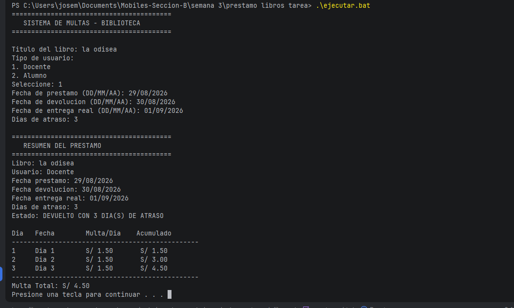

# Sistema de Multas de Biblioteca

**Curso:** Desarrollo de Aplicaciones Moviles
**Estudiante:** Jose Leon Barzola Veliz
**Seccion:** B

---

## Descripcion

Programa que calcula multas por atraso en la devolucion de libros de biblioteca. El usuario ingresa los datos del prestamo y el sistema calcula la multa a S/ 1.50 por dia de atraso.

## Funcionalidades

- Ingresar titulo del libro
- Seleccionar tipo de usuario (Docente/Alumno)
- Ingresar fecha de prestamo, devolucion y entrega real
- Calcular dias de atraso
- Calcular multa a S/ 1.50 por dia
- Mostrar tabla con detalle de multa por dia y acumulado
- Mostrar multa total

## Como Ejecutar

1. Abrir la carpeta `prestamo libros tarea` en Android Studio
2. Ejecutar `ejecutar.bat` desde la terminal, o
3. Ejecutar `.\gradlew.bat :console:fatJar` y luego `.\ejecutar.bat`

## Captura de Salida

