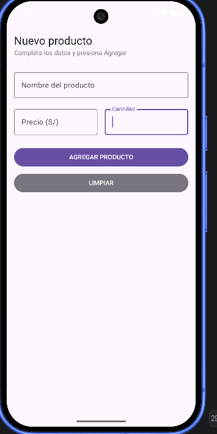
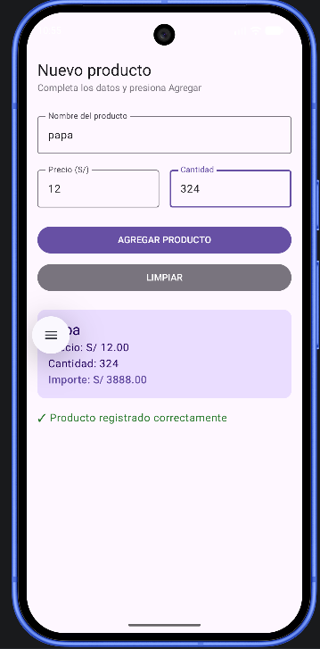
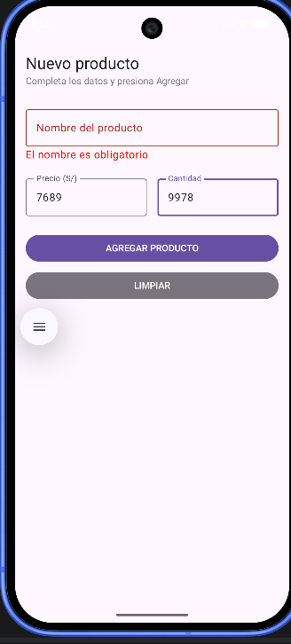
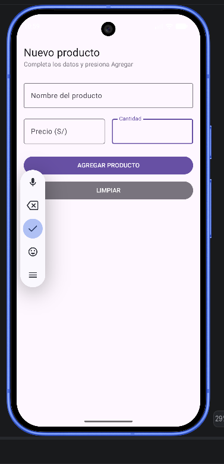

# Laboratorio 03: Registro de Producto con Jetpack Compose

**Estudiante:** José León Barzola Veliz  
**Sección:** B

## Descripción

Aplicación de registro de producto desarrollada con Jetpack Compose. Permite ingresar nombre, precio y cantidad de un producto, y muestra una Card con el resumen y el importe calculado (precio × cantidad con 2 decimales).

## Capturas de pantalla

### Pantalla vacía

### Pantalla con producto registrado

### Validación de campos vacíos

### Botón Limpiar

## ¿Qué pasaría si declaras las variables de los campos SIN remember?

Si se declaran las variables sin `remember`, cada vez que Compose redibuja la pantalla (por ejemplo, al escribir en un campo), las variables se vuelven a crear con su valor inicial (""). Esto significa que:

- El texto que escribes desaparece al perder el foco
- Los campos nunca guardan lo que el usuario ingresa
- La pantalla nunca puede mostrar los datos porque se resetean en cada recomposición

`remember` guarda el valor entre recomposiciones, permitiendo que el estado persista mientras la pantalla esté visible.

## Mejora con IA

| Prompt que usé | Qué generó Gemini | Qué acepté o corregí (y por qué) |
|---|---|---|
| "En PantallaRegistro, agrega validación de campos vacíos: si falta un dato al presionar AGREGAR, mostrar mensaje de error en rojo en lugar de la Card. También agrega un botón Limpiar que vacíe el formulario. No toques la Card de resumen ni los cálculos." | Agregó variables `errorNombre`, `errorPrecio`, `errorCantidad` con `remember`, validación con `isBlank()` en el onClick, `isError` en cada OutlinedTextField, mensajes de error en rojo, y botón LIMPIAR con `ButtonDefaults.buttonColors` usando color outline. | Acepté toda la lógica de validación y el botón Limpiar. Corregí: agregué `singleLine = true` a los 3 campos para que no se expandan al escribir mucho texto (la IA no lo incluyó). |
