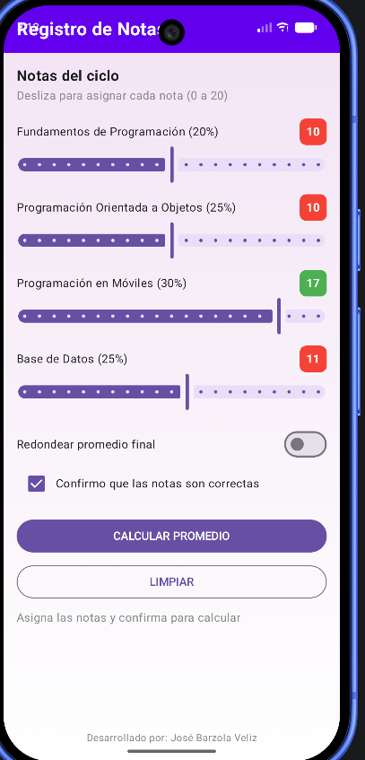
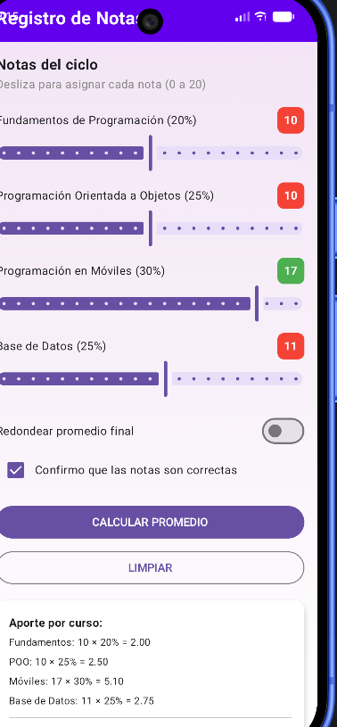
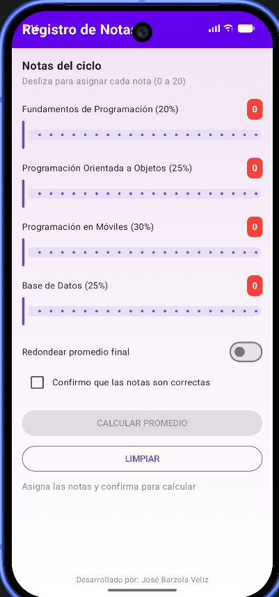

# Laboratorio 3 - Registro de Notas

## Desarrollador
**José Barzola Veliz**

## Descripción
Aplicación móvil desarrollada en Kotlin con Jetpack Compose que permite registrar notas de 4 materias, calcular el promedio ponderado y determinar si el estudiante aprobó o no.

## Funcionalidades
- Sliders para asignar notas (0-20) con badges de colores (semáforo)
- Switch para redondear promedio final
- Checkbox de confirmación
- Botón CALCULAR PROMEDIO (deshabilitado hasta confirmar)
- Botón LIMPIAR para reiniciar formulario
- Tarjeta de resultados con aporte por curso
- Observación con 4 categorías (EXCELENTE, APROBADO, EN RECUPERACIÓN, DESAPROBADO)

## Reglas de Negocio
| Curso | Peso |
|-------|------|
| Fundamentos de Programación | 20% |
| Programación Orientada a Objetos | 25% |
| Programación en Móviles | 30% |
| Base de Datos | 25% |

## Observaciones
| Promedio Final | Observación | Color |
|----------------|-------------|-------|
| 17-20 | EXCELENTE | Verde oscuro |
| 13-16.99 | APROBADO | Verde |
| 10-12.99 | EN RECUPERACIÓN | Ámbar |
| <10 | DESAPROBADO | Rojo |

## Capturas

### Sliders con semáforo

### Tarjeta de resultados

### Botón LIMPIAR

